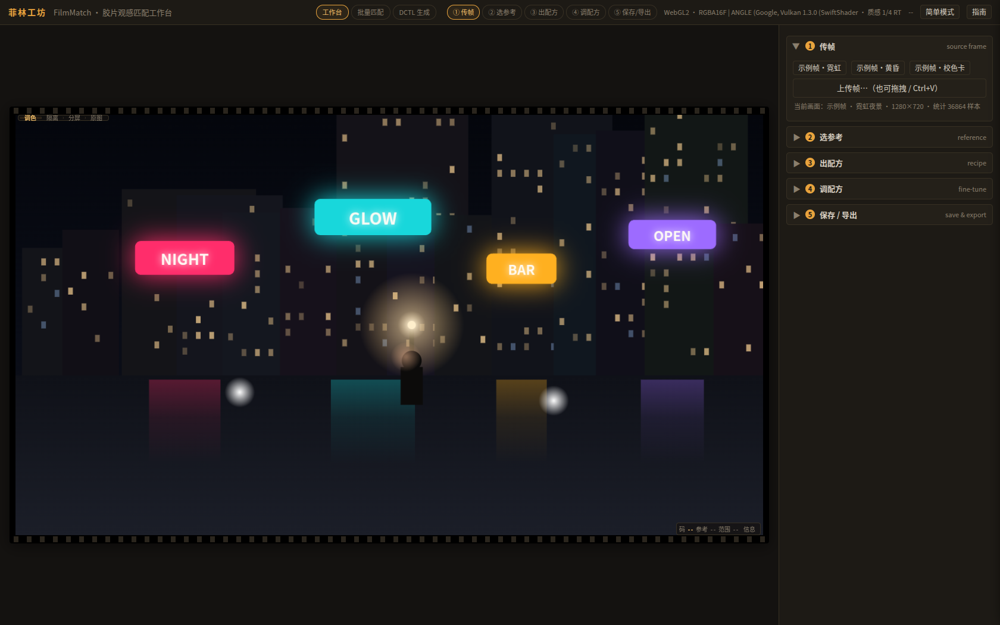
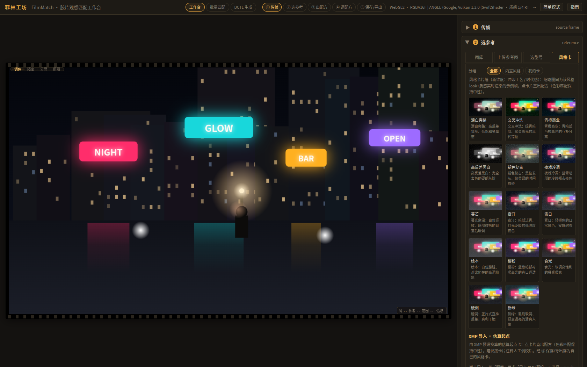

# 菲林工坊 FilmMatch

**中文** | [English](#english)

> **仓库镜像 Mirrors** · 主仓库：https://cnb.cool/cnb_edgerunner/filmmatch ｜ GitHub 镜像：https://github.com/ijrunner/filmmatch

一个面向达芬奇（DaVinci Resolve）调色师的**胶片观感匹配工作台**：上传一帧画面，选参考（图库 / 自传参考图 / 胶片型号卡 / 风格卡），引擎自动合成「色彩匹配 + 光晕 + 颗粒 + 柔光 + 暗角」的完整胶片配方，实时预览、逐组微调，然后一键导回达芬奇。

以**配方（Recipe）**为原子单位，而非传统 LUT：配方带版本号（Schema v1.3）、参数溯源（标注 / 估算 / 手调）与配方码分享。



## 功能特性

- **五步流程**：① 传帧（拖拽 / 粘贴 / 示例帧）→ ② 选参考（图库、上传参考图、10 张胶片型号卡、14 张风格卡）→ ③ 出配方 → ④ 调配方（简单 / 高级模式、参数搜索、组级重置、前后对比浮层）→ ⑤ 保存导出。
- **三条达芬奇交付通道**：
  - 色彩层 → `.cube` 3D LUT（支持 Full/Data ↔ Video/Legal 数据范围声明，可直写达芬奇 LUT 目录）；
  - 全层质感 → **DCTL 生成器**（52 个参数面板、中英双语标签、逐像素签名走 LUT 路径、可选内联匹配段的单节点导出）；
  - 节点包 → 搭建清单 + PowerGrade（Grab Still）引导。
- **质感管线**：光晕 / 颗粒（动态、团簇、片门抖动）/ 柔光 / Bloom / 暗角色散 / 染料串扰（六系数）/ 分离色调 / HSL 八色相（网页与 .cube 承载）。
- **XMP 预设导入**：批量解析 Lightroom/ACR 预设（双方言）→ 映射为「估算起点卡」（曲线族最小二乘反解、SplitToning 一一对应、品牌词清洗），可再调校后存为自己的卡。
- **性能**：look 数学进片元着色器（拖动零重烘）、GPU tile-atlas LUT 烘焙（自动回退 CPU）、Worker 化、首屏 gzip ~65KB。
- **质量工具链**：698 条单测、81 项 E2E、44 张视觉回归基线、性能基线、观感对齐测量台。



## 快速开始

```bash
npm install
npm run dev        # 开发服务器
npm run build      # 类型检查 + 产物构建
npm run test       # 单元测试（vitest）
```

浏览器打开后点「载入示例帧」即可离线体验完整流程（示例帧为程序生成，无网络依赖）。

### 用到达芬奇里（约 3 分钟）

1. ⑤ 导出 `.cube`（或 DCTL 生成页导出 `.dctl`）；
2. `.dctl` 放入达芬奇 LUT 目录 → **ResolveFX Color → DCTL** 加载（色彩层-only 的逐像素签名版也可走 LUT 路径）；
3. 按 [端到端走查清单](docs/guides/端到端走查清单.md) 校验数据范围（Full/Data ↔ Video/Legal）与观感。

详细的节点搭建与 PowerGrade（Grab Still）路径见 [达芬奇质感搭建指南](docs/guides/达芬奇质感搭建指南.md)。

## 文档

- [配方 Schema v1.3](docs/prd/配方Schema-v1.3.md) —— 配方 JSON 数据契约（向后兼容 v1 / v1.1 / v1.2）
- [观感对齐清单](docs/research/观感对齐清单-R9.md) —— 网页预览 ↔ 达芬奇 DCTL 的逐项差异与诚实边界
- [端到端走查清单](docs/guides/端到端走查清单.md) / [质感搭建指南](docs/guides/达芬奇质感搭建指南.md)

## 开发

```bash
bash tools/e2e-shots.sh          # 构建 → 无头 Chromium 截图 → E2E 断言 → 视觉基线比对
node tools/visual-baseline.mjs --record   # 有意 UI 变更后更新视觉基线
node tools/perf-baseline.mjs     # 性能基线（拖动零重烘判据 / 烘焙耗时）
node tools/xmp-to-cards.mjs <dir>         # XMP 批量转「估算起点卡」CLI
node tools/card-quality-gate.mjs --dir <dir>   # 卡片质量门（区间 / 品牌词 / 两两差异）
```

## 状态与边界（诚实声明）

- 浏览器端与无头（SwiftShader）E2E 已全量验证；**达芬奇实机观感比对**请按走查清单自行校验（不同 GPU / 版本可能有差异）。
- XMP 导入产物是**估算起点，不是精确复刻**（曲线族为有损形状反解，HSL 量纲为工程近似），导入后请按口味微调。
- GPU 烘焙耗时数字来自软件光栅化，不代表真实 GPU 收益。

## License

[MIT](LICENSE)

---

<a id="english"></a>
# FilmMatch (菲林工坊)

A **film-look matching workbench** for DaVinci Resolve colorists: drop in a frame, pick a reference (gallery / your own still / film-stock card / style card), and the engine composes a complete film recipe — color match + halation + grain + soft glow + vignette — with live preview, per-group fine-tuning, and one-click delivery back into Resolve.

Built around the **Recipe** as the atomic unit instead of a flat LUT: versioned JSON (Schema v1.3), per-parameter provenance (annotated / estimated / user), and shareable recipe codes.


## Features

- **Five-step flow**: load a frame → pick a reference → auto-compose → fine-tune (simple/advanced modes, param search, per-group reset, persistent compare overlay) → save & export.
- **Three delivery channels into Resolve**: `.cube` 3D LUT (with Full/Data ↔ Video/Legal range declaration), a **DCTL generator** (52-param panel, bilingual labels, per-pixel-signature LUT path, optional single-node export with inlined CDL match), and a node-tree build guide (PowerGrade via Grab Still).
- **Texture pipeline**: halation, dynamic grain (clusters, gate weave), soft glow, bloom, vignette & chromatic aberration, six-coefficient dye crosstalk, split toning, 8-hue HSL (web + .cube).
- **XMP preset import**: batch-parse Lightroom/ACR presets into "estimated starting-point" cards (least-squares curve fitting, near 1:1 split-toning mapping, brand-word sanitizing).
- **Performance**: look math in the fragment shader (zero re-bake while dragging), GPU tile-atlas LUT baking with CPU fallback, workerized baking/matching, ~65KB gzipped first load.
- **Tooling**: 698 unit tests, 81 E2E assertions, 44-shot visual regression baseline, perf baseline, look-alignment measurement bench.

## Quick start

```bash
npm install
npm run dev        # dev server
npm run build      # typecheck + build
npm run test       # unit tests (vitest)
```

Click "载入示例帧" (load sample frame) after opening the page — the whole flow works offline with procedurally generated frames.

### Into DaVinci Resolve (~3 min)

1. Export `.cube` (or a `.dctl` from the DCTL page);
2. Put the `.dctl` into Resolve's LUT folder → load via **ResolveFX Color → DCTL**;
3. Follow the [walkthrough checklist](docs/guides/端到端走查清单.md) (Chinese) to verify data range and look.

## Status & honest boundaries

- Fully verified in-browser and under headless (SwiftShader) E2E; **real-GPU Resolve look comparison** should be validated per the checklist on your machine.
- XMP imports are **estimated starting points, not exact replicas** — tune to taste after importing.
- GPU bake timings in this repo were measured under software rasterization and do not represent real-GPU gains.

## License

[MIT](LICENSE)
